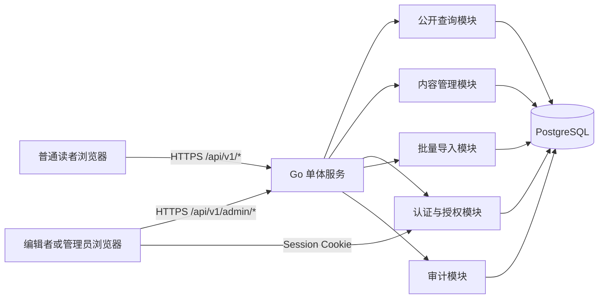
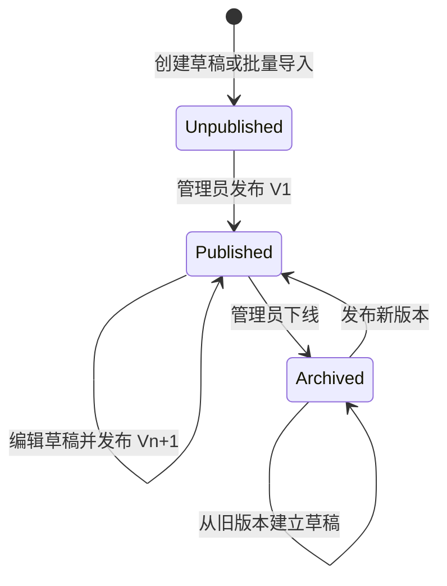

# 历史 Wiki 服务端技术方案

- **状态**：已确认
- **日期**：2026-09-12
- **适用范围**：历史事件公开查询、编辑管理和录入
- **关联决策**：ADR-0002 至 ADR-0009

## 1. 背景与目标

当前项目是 React + TypeScript + Vite 的纯前端应用，历史事件来自内存 Mock Repository。服务端建设需要在保留现有时间线交互语义的基础上，把历史事件变为可持续录入、管理和公开查询的数据。

本方案实现以下目标：

1. 提供公开 REST API，支持时间范围、关键词和多维筛选查询历史事件。
2. 提供受认证保护的管理 API，支持历史事件草稿、发布、下线、恢复及版本查看。
3. 使用 PostgreSQL 持久化历史事件和规范实体，保证关系完整性和查询性能。
4. 提供 `/admin` 管理区所需的账号、规范实体、单条录入和 JSON 批量导入能力。
5. 保持现有事件显著度策略、筛选逻辑、计数语义和稳定排序。

### 1.1 非目标

首版明确不包含：

- 史料来源、引文或学术可信度模型。
- 普通读者投稿、评论或审核队列。
- 图片、附件、富媒体和对象存储。
- 多语言内容。
- 历史事件之间的因果或关联图谱。
- Elasticsearch 等独立搜索服务。
- Kubernetes、多实例高可用或分布式缓存。
- 数据库备份和灾难恢复。

> **风险声明**：事件版本只能防止误修改，不能防止数据库实例损坏。首版不备份意味着历史事件、账号、版本和审计记录可能全部且永久丢失，详见 ADR-0009。

## 2. 现有契约与兼容要求

服务端必须保留以下现有行为：

- 时间表述支持精确日期、年份、约数年份和闭区间。
- 公元前 1 年与公元 1 年相邻，不存在公元 0 年。
- 范围匹配采用闭区间相交语义。
- 同一筛选维度内为 OR，不同筛选维度及关键词之间为 AND。
- 关键词搜索标题、摘要、正文、地点、历史人物和主题标签；不搜索地区、历史时期和主分类。
- 排序依次为事件开始时间、展示顺序、中文标题和事件 ID。
- `sourceTotal` 表示全部已发布事件数；`totalMatching` 表示显著度过滤前的匹配数。
- 前端不传显著度阈值；服务端根据可见时间跨度决定返回 L1、L2 或 L3，遵守 ADR-0002。
- 时间线查询必须返回当前策略下的完整事件集合，不静默截断。

需要调整的前端契约：

- 地区、地点、历史时期、历史人物和主题标签由字符串改为带稳定 ID 的引用对象。
- 单个 `place` 改为 `places[]`。
- URL 中的筛选条件和值使用规范实体 ID。
- 增加按事件 ID 查询详情的能力。
- 增加 `/admin` 管理区和登录状态。
- 移除 Mock 数据作为默认数据源以及“产品演示数据”固定文案。

## 3. 总体架构



### 3.1 技术选型

| 层次 | 选择 | 说明 |
| --- | --- | --- |
| 语言 | Go | 独立 Go Module，服务端位于 `server/` |
| HTTP | `net/http` + Chi | 保持轻量路由和标准中间件模型 |
| 数据访问 | pgx + sqlc | 使用显式 SQL 和编译期生成的类型安全代码 |
| 数据库 | PostgreSQL | 支持事务、约束、JSONB、GiST 和 trigram 索引 |
| 数据库迁移 | Goose | 迁移由独立命令显式执行 |
| API 契约 | OpenAPI 3.1 | 使用 oapi-codegen 生成 Go 边界类型，并生成 TypeScript 客户端 |
| 密码散列 | Argon2id | 不保存明文或可逆密码 |
| 部署 | Docker | 开发使用 Docker Compose，生产运行单个 Go 实例和单个 PostgreSQL 实例 |

### 3.2 服务端目录建议

```text
server/
├── cmd/
│   ├── api/                 # HTTP 服务入口
│   ├── adminctl/            # 初始化管理员等一次性命令
│   └── migrate/             # 数据库迁移入口
├── internal/
│   ├── api/
│   │   ├── public/          # 公开查询接口
│   │   ├── admin/           # 管理接口
│   │   └── middleware/      # 请求 ID、认证、CSRF、限流、日志
│   ├── auth/
│   ├── audit/
│   ├── catalog/             # 规范实体管理
│   ├── event/               # 草稿、发布、下线和恢复
│   ├── historyquery/        # 时间线查询与显著度策略
│   ├── importing/
│   └── store/
│       ├── queries/         # sqlc SQL
│       └── generated/       # sqlc 生成代码
├── migrations/
├── openapi/openapi.yaml
├── sqlc.yaml
├── go.mod
└── go.sum
```

## 4. 领域模型与生命周期

### 4.1 历史事件组成

历史事件包含：

- 不可变 UUIDv7。
- 可修改且唯一的 slug；slug 只用于可读性，不承担永久身份。
- 标题、摘要、完整叙述。
- 时间表述。
- 一个固定主分类。
- 事件显著度 L1、L2 或 L3。
- 展示顺序，默认 1000，数值越小越靠前。
- 零到多个历史时期、地点、历史人物及主题标签。
- 至少一个地区。

### 4.2 发布状态与活动草稿

事件的公开发布状态与草稿存在性相互独立：

- `unpublished`：从未发布，公开接口不可见。
- `published`：公开接口读取当前发布版本；可以同时存在活动草稿。
- `archived`：已下线，公开列表和详情均不可见；历史发布版本仍保留。

每个事件最多存在一个活动草稿。活动草稿是唯一可修改的内容，事件版本一旦发布便不可修改或删除。



### 4.3 发布事务

管理员发布时在单个数据库事务中完成：

1. 锁定事件及活动草稿。
2. 验证草稿版本和发布权限。
3. 执行完整发布校验。
4. 写入新的不可变事件版本及其关联关系。
5. 更新事件的当前发布版本和发布状态。
6. 删除活动草稿。
7. 更新公开搜索投影。
8. 写入审计记录。

任一步骤失败则全部回滚，公开接口继续读取原发布版本。

### 4.4 恢复和下线

- 恢复旧版本不会重新激活或修改旧记录，而是复制为新的活动草稿。
- 如果已有活动草稿，恢复请求返回 `409 Conflict`，避免静默覆盖。
- 下线只修改发布状态，不删除事件、版本或关联关系。
- 已下线事件重新发布时生成新的版本号。

## 5. 数据库设计

### 5.1 核心表

| 表 | 作用 | 关键字段和约束 |
| --- | --- | --- |
| `events` | 历史事件身份和发布指针 | `id UUID PK`、`slug UNIQUE`、`publication_status`、`current_revision_id`、创建信息 |
| `event_drafts` | 每个事件唯一的可变草稿 | `event_id UNIQUE`、内容字段、`lock_version`、`based_on_revision_no`、修改人和时间 |
| `event_revisions` | 不可变发布快照 | `id UUID PK`、`event_id`、`revision_no`、内容字段、发布人和时间；`UNIQUE(event_id, revision_no)` |
| `regions` | 地区规范实体 | 当前名称、消歧名称、状态、合并目标、乐观锁版本 |
| `places` | 地点规范实体 | 当前名称、消歧名称、状态、合并目标、乐观锁版本 |
| `historical_periods` | 历史时期规范实体 | 当前名称、消歧名称、状态、合并目标、乐观锁版本 |
| `historical_figures` | 历史人物规范实体 | 当前名称、消歧名称、状态、合并目标、乐观锁版本 |
| `topic_tags` | 主题标签规范实体 | 当前名称、消歧名称、状态、合并目标、乐观锁版本 |
| `place_regions` | 地点所属地区 | 多对多关系，唯一约束防止重复关联 |
| `period_regions` | 历史时期所属语境 | 多对多关系；每个有效时期至少关联一个地区 |
| `event_draft_*` | 草稿和各规范实体的关联 | 分别为地区、地点、时期、人物和标签建立关联表 |
| `event_revision_*` | 发布版本和各规范实体的关联 | 只保存规范实体 ID，不保存名称快照 |
| `published_event_search` | 公开搜索投影 | 当前发布版本的可搜索文本及 trigram 索引 |
| `users` | 编辑者和管理员账号 | 邮箱、Argon2id 密码散列、角色、停用时间、锁版本 |
| `sessions` | 服务端会话 | 随机令牌摘要、用户、过期和撤销时间 |
| `audit_logs` | 追加式管理审计 | 操作者、动作、目标、请求 ID、时间、变更摘要 |
| `import_batches` | JSON 导入记录 | 幂等键、文件摘要、状态、记录数和错误摘要 |
| `idempotency_records` | 写接口幂等结果 | 操作者、作用域、幂等键、请求摘要和响应摘要 |

### 5.2 不可变约束

- 应用数据库角色无权更新或删除 `event_revisions` 和对应关联表。
- 数据库触发器拒绝对事件版本和审计日志执行 `UPDATE` 或 `DELETE`。
- 数据库迁移角色单独管理结构变化，不供应用运行时使用。
- 规范实体名称不做版本化；改名后所有事件版本统一展示新名称，改名行为通过审计日志追踪。

### 5.3 规范实体状态与合并

规范实体状态包括 `active`、`inactive` 和 `merged`：

- 编辑者可以创建新实体。
- 管理员可以修改、停用或合并实体。
- 停用实体不允许被新草稿添加，但已有草稿和版本仍可显示。
- 合并实体保留原 ID，并通过 `merged_into_id` 指向目标实体。
- 不修改不可变事件版本中的旧 ID；读取和筛选时解析到最终目标 ID。
- 公共响应只返回最终目标 ID 和当前名称。
- 禁止把实体合并到已合并实体，避免形成长链或循环。

### 5.4 时间表述存储

草稿和版本使用结构化列，不将前端浮点坐标作为事实来源：

| 字段 | 说明 |
| --- | --- |
| `time_kind` | `exact_date`、`year`、`circa` 或 `interval` |
| `start_era` | `BCE` 或 `CE` |
| `start_year` | 大于等于 1 的整数 |
| `start_month`、`start_day` | 仅精确日期使用 |
| `start_circa` | 区间起点是否为约数 |
| `end_era`、`end_year`、`end_circa` | 仅闭区间使用 |
| `start_coordinate`、`end_coordinate` | 写入时计算的查询和排序坐标 |

坐标规则：

- 公元 `N` 年的基础坐标为 `N`。
- 公元前 `N` 年的基础坐标为 `1 - N`。
- 年份、约数年份及区间端点使用基础坐标。
- 精确日期使用延伸公历计算年内日序，再映射为小数坐标。
- 前端和服务端共享同一算法及测试向量，不再使用约 30.4375 日/月的近似计算。
- 区间必须满足开始坐标小于等于结束坐标。
- 月、日必须通过延伸公历合法性校验。

数据库可增加生成的 `numrange` 并建立 GiST 索引，以支持闭区间相交查询。

### 5.5 发布校验

草稿允许不完整；发布时必须满足：

- 标题：1–200 个 Unicode 字符。
- 摘要：1–500 个 Unicode 字符。
- 正文：1–20,000 个 Unicode 字符。
- slug：3–120 个小写 ASCII 字符、数字或连字符，且全局唯一。
- 时间表述完整、合法且区间有序。
- 主分类属于政治、军事、文化、科技、社会或交流。
- 至少关联一个有效地区。
- 事件显著度属于 1、2、3。
- 展示顺序范围为 0–1,000,000，默认 1000。
- 关联 ID 必须存在，且不得新增已停用或已合并实体。

历史时期、地点、人物和主题标签均可为空。单个事件限制最多关联 20 个地区、50 个地点、20 个时期、100 个人物和 50 个主题标签，防止异常请求放大查询成本。

## 6. API 设计

API 统一使用 `/api/v1` 前缀、JSON 和 UTF-8。公开接口免登录；管理接口要求有效 Session、CSRF 校验及角色授权。

### 6.1 公开接口

#### 查询时间线事件

```http
GET /api/v1/events?from=-220&to=300&pad=130&q=统一&region=<uuid>&figure=<uuid>&category=政治
```

参数：

- `from`、`to` 必填，是时间线坐标且 `from < to`；它们始终表示可视范围，用于计算显著度和匹配计数。
- `pad` 可选，非负有限数值，默认 `0`；表示在可视范围两侧额外读取的历史年数，只扩大返回的事件窗口。
- `q` 可选，去除首尾空白后最长 100 字符。
- `period`、`region`、`figure` 可重复出现，值为 UUID。
- `category` 可重复出现，值为固定主分类。

响应示例：

```json
{
  "events": [
    {
      "id": "018f5f90-8d5d-7d2a-8b61-cf1aaf64d58f",
      "slug": "qin-unification",
      "title": "秦统一六国",
      "summary": "秦结束战国割据局面。",
      "narrative": "……",
      "time": { "kind": "year", "year": { "era": "BCE", "year": 221 } },
      "primaryCategory": "政治",
      "periods": [
        { "id": "…", "name": "战国时期", "disambiguationLabel": "中国" }
      ],
      "regions": [{ "id": "…", "name": "中国", "disambiguationLabel": null }],
      "places": [],
      "figures": [{ "id": "…", "name": "秦始皇", "disambiguationLabel": null }],
      "topicTags": [{ "id": "…", "name": "统一", "disambiguationLabel": null }],
      "prominence": 1,
      "displayOrder": 1000
    }
  ],
  "sourceTotal": 100000,
  "totalMatching": 314,
  "returnedProminence": 2,
  "coveredFrom": -350,
  "coveredTo": 430
}
```

API 中继续使用现有 `exact-date`、`year`、`circa` 和 `interval` 时间联合类型；数据库内部枚举名称不直接暴露。规范实体引用统一为 `{id, name, disambiguationLabel}`，名称只负责显示。

显著度规则保持现状：

- 可见跨度大于等于 4000 年：只返回 L1。
- 可见跨度大于等于 1200 年且小于 4000 年：返回 L1–L2。
- 可见跨度小于 1200 年：返回 L1–L3。

如果显著度过滤后超过 5,000 条，返回 `422 Unprocessable Content` 和错误码 `result_set_too_large`，前端提示用户缩小时间范围；不得只返回前 5,000 条。

预取窗口规则：

- `coveredFrom = from - pad`，`coveredTo = to + pad`，响应返回实际使用的事件窗口。
- `events` 是 `[coveredFrom, coveredTo]` 内、显著度符合 `returnedProminence` 的完整集合，可以比可视范围更宽，供前端平移时平滑渲染。
- `totalMatching` 仍只统计可视范围 `[from, to]` 内匹配搜索与筛选的事件数；显著度过滤发生在计数之后。
- `returnedProminence` 仍由可视跨度 `to - from` 决定，`pad` 不改变显著度。
- 5,000 条上限适用于实际返回的 `events`；预取窗口过密时客户端应回退到 `pad=0`。

#### 查询事件详情

```http
GET /api/v1/events/{eventId}
```

- 返回当前发布版本的完整内容。
- 从未发布或已下线的事件统一返回 `404`。
- 分享链接使用不可变事件 UUID，不依赖当前时间线查询结果。

#### 查询筛选元数据

```http
GET /api/v1/event-metadata
```

- 返回被已发布事件引用的规范实体。
- 历史时期按照 `period_regions` 的真实语境分组；一个时期可出现在多个地区语境中。
- 响应中的规范实体均包含 `id`、`name` 和可选 `disambiguationLabel`。

#### 查询时间边界

```http
GET /api/v1/event-bounds
```

有数据时返回最小和最大坐标；空库返回：

```json
{ "hasEvents": false, "start": null, "end": null }
```

前端必须提供明确空状态，不再使用虚构的 `-100` 到 `100` 边界。

### 6.2 认证接口

| 方法 | 路径 | 作用 |
| --- | --- | --- |
| `POST` | `/api/v1/auth/login` | 邮箱和密码登录，建立 Session |
| `POST` | `/api/v1/auth/logout` | 撤销当前 Session |
| `GET` | `/api/v1/auth/me` | 获取当前账号和角色 |
| `POST` | `/api/v1/auth/change-password` | 用户修改自己的密码，撤销全部 Session 后重新登录 |

管理员账号操作：

| 方法 | 路径 | 作用 |
| --- | --- | --- |
| `GET` | `/api/v1/admin/users` | 列出保留的有效及停用账号 |
| `POST` | `/api/v1/admin/users` | 创建编辑者或管理员 |
| `PATCH` | `/api/v1/admin/users/{id}` | 修改角色或停用账号 |
| `POST` | `/api/v1/admin/users/{id}/reset-password` | 设置一次性临时密码并撤销全部 Session |

### 6.3 历史事件管理接口

| 方法 | 路径 | 角色 | 作用 |
| --- | --- | --- | --- |
| `POST` | `/api/v1/admin/events` | 编辑者、管理员 | 创建事件和活动草稿 |
| `GET` | `/api/v1/admin/events` | 编辑者、管理员 | 按状态分页查询管理列表 |
| `GET` | `/api/v1/admin/events/{id}` | 编辑者、管理员 | 查询事件、草稿和当前发布信息 |
| `PATCH` | `/api/v1/admin/events/{id}` | 编辑者、管理员 | 修改 slug 等事件级元数据 |
| `PATCH` | `/api/v1/admin/events/{id}/draft` | 编辑者、管理员 | 修改活动草稿 |
| `POST` | `/api/v1/admin/events/{id}/draft` | 编辑者、管理员 | 从当前版本建立草稿 |
| `POST` | `/api/v1/admin/events/{id}/publish` | 管理员 | 发布活动草稿 |
| `POST` | `/api/v1/admin/events/{id}/archive` | 管理员 | 下线事件 |
| `GET` | `/api/v1/admin/events/{id}/revisions` | 编辑者、管理员 | 查询发布版本列表 |
| `GET` | `/api/v1/admin/events/{id}/revisions/{number}` | 编辑者、管理员 | 查询指定版本 |
| `POST` | `/api/v1/admin/events/{id}/revisions/{number}/restore` | 编辑者、管理员 | 将指定版本复制为活动草稿 |

草稿更新使用 HTTP `If-Match`：

```http
If-Match: "draft-7"
```

版本不一致返回 `409 Conflict`，并携带最新草稿版本号。创建事件等可重试写操作使用 `Idempotency-Key` 请求头。

创建事件时同时提交 slug 和首个草稿；后续草稿更新使用规范实体 ID，不接受名称作为关联依据。slug 通过事件级 `PATCH` 单独修改：

```json
{
  "slug": "qin-unification",
  "title": "秦统一六国",
  "summary": "秦结束战国割据局面。",
  "narrative": "……",
  "time": { "kind": "year", "year": { "era": "BCE", "year": 221 } },
  "primaryCategory": "政治",
  "regionIds": ["…"],
  "placeIds": [],
  "periodIds": ["…"],
  "figureIds": ["…"],
  "topicTagIds": ["…"],
  "prominence": 1,
  "displayOrder": 1000
}
```

### 6.4 规范实体管理接口

分别提供以下资源：

- `/api/v1/admin/regions`
- `/api/v1/admin/places`
- `/api/v1/admin/periods`
- `/api/v1/admin/figures`
- `/api/v1/admin/topic-tags`

编辑者可以创建和查询；管理员可以修改、停用和执行：

```http
POST /api/v1/admin/{resource}/{id}/merge
```

合并请求包含目标 ID，服务端校验类型一致、目标有效且不会形成循环。

### 6.5 JSON 批量导入

```http
POST /api/v1/admin/imports/validate
POST /api/v1/admin/imports
```

- 仅管理员可以执行正式导入。
- 预检查返回逐条错误，但不写数据库。
- 正式导入必须携带 `Idempotency-Key`。
- 单批最多 10,000 条或 20 MiB，以先达到者为准。
- 所有记录在一个事务中创建为草稿；任一记录失败则整批回滚。
- 导入不得发布事件，也不得更新既有事件。
- UUID 或 slug 与既有事件或批次内其他记录冲突时整批失败。

### 6.6 错误格式

使用 RFC 9457 Problem Details，并增加稳定业务错误码和字段错误：

```json
{
  "type": "https://history-wiki.example/problems/validation-error",
  "title": "请求校验失败",
  "status": 422,
  "detail": "时间区间结束早于开始",
  "instance": "/api/v1/admin/events/…/publish",
  "code": "invalid_time_interval",
  "requestId": "…",
  "errors": [
    { "field": "time.end", "code": "before_start", "message": "结束时间不得早于开始时间" }
  ]
}
```

## 7. 查询与搜索实现

### 7.1 时间范围和筛选

公开查询只读取 `publication_status = 'published'` 且指向当前发布版本的事件。

范围条件：

```text
event.start_coordinate <= query.to
AND event.end_coordinate >= query.from
```

筛选规则：

- 同维度所选 ID 使用 OR。
- 地区、时期、人物、分类以及关键词之间使用 AND。
- 合并后的旧实体 ID和目标实体 ID按同一规范身份匹配。

建议索引：

- 当前发布事件时间范围的 GiST 索引。
- 所有关联表的 `(event_revision_id, entity_id)` 唯一索引。
- 所有关联表的 `(entity_id, event_revision_id)` 反向索引。
- `events(publication_status, current_revision_id)` 索引。

### 7.2 搜索

使用 PostgreSQL `pg_trgm`，不使用 PostgreSQL 默认全文分词或 Elasticsearch。维护 `published_event_search` 读模型，拼接：

- 标题、摘要和正文。
- 当前地点名称。
- 当前历史人物名称。
- 当前主题标签名称。

文本统一执行 Unicode 规范化和大小写折叠，搜索保持子串匹配。地区、历史时期和主分类只通过结构化筛选查询。

发布、下线、规范实体改名或合并时，在同一事务中更新受影响的搜索投影。

### 7.3 稳定排序

候选结果最多 5,000 条。数据库先按开始坐标和展示顺序排序，Go 服务使用 `golang.org/x/text/collate` 进行稳定的中文标题排序，最后以 UUID 打破平局，避免依赖部署环境的数据库 locale。

### 7.4 一致计数

同一 SQL 语句或同一只读事务内计算：

- `sourceTotal`：所有已发布事件数量。
- `totalMatching`：时间、搜索和筛选匹配，但尚未应用显著度阈值的数量。
- `events`：进一步应用显著度阈值后的完整结果。

## 8. 认证、授权与安全

### 8.1 Session

- 登录成功生成至少 256 位随机 Session 令牌；数据库只保存令牌摘要。
- Cookie 设置 `HttpOnly`、`Secure`、`SameSite=Lax` 和根路径。
- 空闲 8 小时失效，最长 7 天；敏感操作可要求近期登录。
- 停用账号、管理员重置密码及用户修改密码会立即撤销相应 Session。
- 首位管理员由 `adminctl create-admin` 交互式命令创建，不提供默认密码。

### 8.2 CSRF 与来源限制

- 仅允许同域调用管理接口，不配置宽泛 CORS。
- 所有非安全方法校验 Origin/Referer 和 CSRF Token。
- 登录接口同样执行来源检查，防止 Login CSRF。

### 8.3 密码

- 密码最少 12 个字符，允许密码管理器生成的长密码。
- 使用 Argon2id；参数作为密码散列的一部分存储并支持未来升级。
- 登录错误统一返回相同响应，避免探测账号是否存在。

### 8.4 限流和请求限制

单实例内使用令牌桶限流：

- 登录：每 IP 每 15 分钟 10 次失败尝试。
- 公开查询：每 IP 每分钟 120 次，允许短时突发。
- 普通管理写操作：每用户每分钟 60 次。
- 正式导入：每管理员每小时 5 次。
- 普通 JSON 请求体最大 2 MiB；导入请求最大 20 MiB。

### 8.5 审计

审计所有管理写操作及登录失败，至少记录：

- UTC 时间、请求 ID、动作、目标类型和目标 ID。
- 操作者账号；登录失败记录被尝试的邮箱。
- 来源 IP、User-Agent 和成功/失败结果。
- 不包含密码、Session、CSRF Token 或完整认证请求体的变更摘要。

审计日志长期保留且不提供删除 API。

## 9. 前端改造

### 9.1 读者端

1. 实现 `HttpHistoryEventRepository`，保留当前 Repository 注入边界，测试继续使用 Mock Repository。
2. 为 Repository 增加 `getById`，分享链接中的事件不在当前范围时单独获取详情。
3. 使用规范实体 ID 读写 URL 筛选条件，元数据负责 ID 到名称的展示映射。
4. 把事件地点从单值改为数组。
5. 使用与服务端一致的精确日期坐标算法。
6. 对搜索输入增加约 250 ms 防抖，并继续通过 `AbortSignal` 取消过期请求。
7. 使用服务端真实上界，移除公元 2030 年硬编码。
8. 处理空数据库状态和 `result_set_too_large` 错误。
9. 移除详情页“产品演示数据”文案及默认演示数据源。

`demoEvents.ts` 不进入数据库且不再作为应用数据源；性能测试生成器可以作为测试夹具保留。

### 9.2 管理区

新增 `/admin` 路由，至少包含：

- 登录和修改密码。
- 历史事件列表、状态筛选和草稿编辑。
- 时间表述编辑器和发布前错误汇总。
- 规范实体搜索、创建和选择。
- 管理员发布、下线、版本恢复和实体治理入口。
- JSON 导入预检查及提交结果页。
- 乐观锁冲突页面，展示服务器最新版本并要求人工重新应用修改。

## 10. 部署与运维

### 10.1 开发环境

Docker Compose 启动：

- Go API。
- PostgreSQL。

Vite 开发服务器将 `/api` 代理到 Go 服务，避免开发环境 CORS 配置。生产构建由 Go 服务提供 SPA 静态文件并对未知非 API 路径回退到 `index.html`。

### 10.2 生产部署

- 多阶段 Docker 构建前端和 Go 二进制。
- 单个容器提供 SPA 与 API，实现同域 Cookie。
- 单个 PostgreSQL 实例持久化数据。
- 发布前显式执行迁移；API 进程不自动修改数据库结构。
- 所有时间戳以 UTC 写入；展示时由前端处理本地时区。

必需配置：

- `DATABASE_URL`
- `PUBLIC_BASE_URL`
- `SESSION_COOKIE_NAME`
- `TRUSTED_PROXY_COUNT`
- `LOG_LEVEL`
- Argon2id 参数及会话时长配置

敏感配置通过部署环境的 Secret 注入，不提交仓库。

### 10.3 健康检查与监控

- `GET /health/live`：进程存活，不访问数据库。
- `GET /health/ready`：验证数据库连接和迁移版本。
- 结构化 JSON 日志包含请求 ID、路由、状态码、耗时和用户 ID。
- 暴露基础 HTTP、数据库连接池、查询耗时、发布结果和导入结果指标。
- 首版不建设分布式链路追踪。

## 11. 性能目标

设计基线为 10 万历史事件、读多写少和 100 QPS 峰值：

- 公开事件查询在返回不超过 5,000 条时，服务端 p95 小于 200 ms。
- 事件详情及元数据查询 p95 小于 100 ms。
- 普通管理写操作 p95 小于 500 ms，不包含大批量导入。
- 连接池设置总连接上限，防止单实例耗尽 PostgreSQL 连接。

首版不引入应用缓存。优先通过正确索引、搜索投影和 SQL 执行计划达到目标；公开详情和元数据可以使用短期 `Cache-Control` 与 ETag 降低重复传输。

## 12. 测试策略

### 12.1 单元测试

- 公元前、公元和无公元 0 年的坐标转换。
- 闰年、日期合法性及闭区间排序。
- 显著度阈值边界：1200 和 4000 年。
- OR/AND 筛选语义、搜索字段及稳定排序。
- 发布状态、恢复、下线和角色授权规则。
- 规范实体合并解析和循环防护。

### 12.2 PostgreSQL 集成测试

- 所有迁移可在空库执行。
- 外键、唯一约束、不可变触发器和 GiST/trigram 索引有效。
- 发布事务的原子性及搜索投影同步。
- 乐观锁、幂等键和并发发布冲突。
- 整批导入成功或整批回滚。
- 合并实体后旧 ID 和目标 ID 的筛选结果一致。

### 12.3 API 与前端契约测试

- OpenAPI 文档通过校验，生成代码无未提交差异。
- RFC 9457 错误格式和状态码一致。
- Session、CSRF、停用账号及密码重置场景。
- 前端 Repository 的 HTTP 合约测试复用现有 Mock Repository 行为断言。
- 分享链接可以通过 `GET /events/{id}` 恢复范围外事件。

### 12.4 性能测试

- 将现有 10,000 条前端性能数据扩展为 100,000 条数据库测试数据。
- 覆盖宽时间范围、窄范围高密度、中文子串搜索和多维筛选。
- 验证超过 5,000 条时明确失败而非截断。

## 13. 交付阶段

### 阶段一：服务骨架与数据基础

- 建立 `server/` Go Module、Docker Compose、迁移和 sqlc。
- 实现时间模型、规范实体表、事件草稿和版本表。
- 提交 OpenAPI 3.1 初版。

### 阶段二：账号和管理闭环

- 实现本地账号、Session、CSRF 和角色授权。
- 实现规范实体管理、事件草稿、发布、下线和版本恢复。
- 实现事务性 JSON 导入和审计。

### 阶段三：公开查询与前端接入

- 实现范围查询、显著度策略、搜索投影、详情、元数据和边界接口。
- 实现 `HttpHistoryEventRepository` 和 ID 化筛选。
- 增加 `/admin`，移除演示数据及固定演示文案。

### 阶段四：验证与上线

- 完成契约、集成、安全和 10 万数据性能测试。
- 验证空库、首次管理员初始化和首条事件发布流程。
- 生产环境执行迁移并发布单实例服务。

## 14. 验收标准

方案实现完成时必须满足：

1. 空数据库启动后，公开页面显示明确空状态。
2. 管理员可创建编辑者，编辑者可录入草稿但不能发布。
3. 管理员发布后，事件能通过时间线查询和详情接口访问。
4. 编辑已发布事件时，读者仍看到旧版本；再次发布后原子切换到新版本。
5. 历史版本不可修改，恢复操作生成新草稿。
6. 下线事件不会出现在任何公开接口，再发布后生成新版本。
7. 同名规范实体可通过消歧名称区分，合并后旧 ID 仍可解析。
8. 查询保持既定筛选、搜索、计数、显著度和排序语义。
9. 单次结果超过 5,000 条时返回明确错误，不丢失或截断数据。
10. JSON 导入只创建草稿，失败时整批回滚，重试不会重复写入。
11. 所有管理写操作均可由审计日志定位到操作者和请求。
12. 现有演示数据不进入生产数据库，详情页不再显示演示声明。

## 15. 已知风险

| 风险 | 影响 | 当前处理 |
| --- | --- | --- |
| 无数据库备份 | 实例损坏可能造成全部数据永久丢失 | 已明确接受；数据重要性提升前必须重审 ADR-0009 |
| 无史料来源 | 无法从系统内验证历史叙述依据 | 首版明确不建设来源模型 |
| 规范实体不版本化 | 改名会改变旧事件版本的显示名称 | 保留实体修改审计，接受统一显示当前名称 |
| 子串搜索能力有限 | 无分词、同义词和相关度排序 | 使用 pg_trgm；未来依据真实需求再评估搜索服务 |
| 完整集合上限 5,000 | 极端高密度范围需要用户缩小视图 | 明确返回错误，不静默截断 |
| 单实例部署 | 服务或数据库故障期间不可用 | 首版接受，不承诺高可用 |
